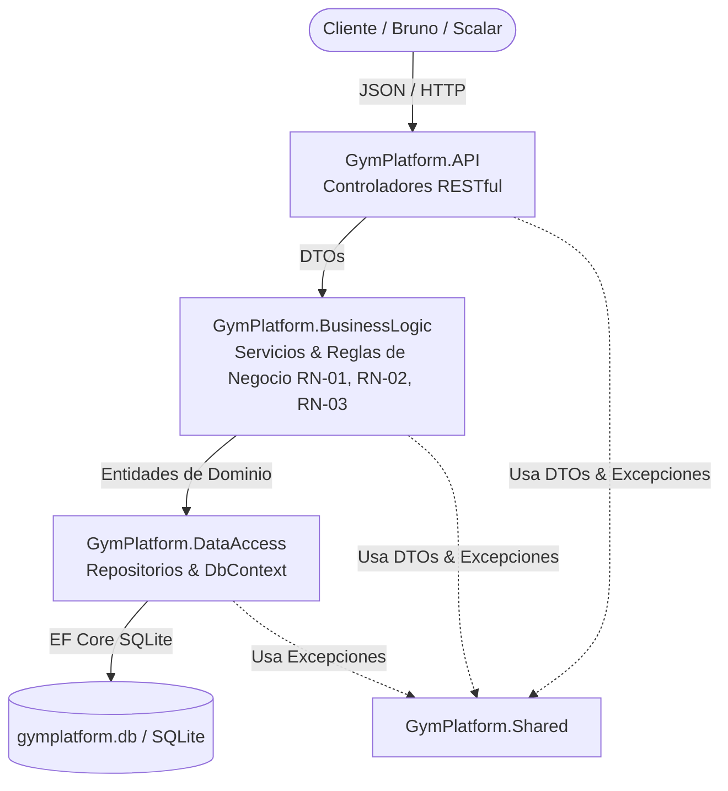

# GYM UP - Plataforma de Membresías y Gestión para Gimnasios 🏋️‍♂️

API RESTful desarrollada en **.NET 10** bajo una estricta **Arquitectura en Capas (N-Tier)**, diseñada para administrar de forma integral y robusta la registración de socios, planes de membresía, actividades y la asignación de horarios sin solapamientos.

---

## 🏛️ Arquitectura N-Tier y Flujo de Datos

El diseño del sistema cumple de forma estricta con el principio de separación de responsabilidades y el flujo unidireccional de control e inversión de dependencias:

$$\text{HTTP Request} \longrightarrow \mathbf{Controller} \longrightarrow \mathbf{Service} \longrightarrow \mathbf{Repository} \longrightarrow \mathbf{DbContext} \ (\text{SQLite})$$



### 📂 Estructura de Proyectos y Carpetas

```text
c:\Repos\Grupo-N-3-Plataforma-De-Membresias-Para-Gimnasios\
├── src/
│   ├── GymPlatform.Shared/                # DTOs y Excepciones Tipadas de Dominio
│   │   ├── DTOs/                          # SocioDTOs, PlanMembresiaDTOs, ActividadDTOs, HorarioDTOs
│   │   └── Exceptions/                    # ValidationException, NotFoundException, ConflictException, etc.
│   ├── GymPlatform.DataAccess/            # Entidades, DbContext, Repositorios e Inicializador
│   │   ├── Context/                       # GymDbContext (DeleteBehavior.Restrict, Índices Únicos)
│   │   ├── Entities/                      # Socio, PlanMembresia, Actividad, Horario (Guid PKs)
│   │   ├── Repositories/                  # Repositorios con AsNoTracking() y asignación de Guid
│   │   └── Data/                          # DbInitializer con datos de prueba
│   ├── GymPlatform.BusinessLogic/         # Lógica de Dominio y Validaciones de Negocio
│   │   ├── Interfaces/                    # ISocioService, IPlanMembresiaService, etc.
│   │   └── Services/                      # Mapeos privados MapToResponseDTO y control de RN
│   ├── GymPlatform.API/                   # Capa de Exposición Web API (.NET 10)
│   │   ├── Controllers/                   # SociosController, PlanesController, ActividadesController, HorariosController
│   │   └── Program.cs                     # Contenedor DI, Scalar UI, OpenAPI, DbInitializer
│   └── GymPlatform.Migrations/            # Ensamblado exclusivo de migraciones EF Core
├── tests/
│   ├── GymPlatform.BusinessLogic.Tests/   # Pruebas unitarias de servicios (xUnit + Moq)
│   └── GymPlatform.API.Tests/             # Pruebas de integración de endpoints (WebApplicationFactory)
└── bruno/                                 # Colección completa de peticiones HTTP en formato Bruno
```

---

## ⚡ Instrucciones de Ejecución

### 1. Requisitos Previos
- [.NET 10 SDK](https://dotnet.microsoft.com/download) instalado.

### 2. Compilar la Solución
```bash
dotnet build
```

### 3. Ejecutar las Pruebas Unitarias y de Integración (21 Tests)
```bash
dotnet test
```

### 4. Iniciar la API RESTful
```bash
dotnet run --project src/GymPlatform.API/GymPlatform.API.csproj
```

### 5. Documentación Interactiva Scalar (OpenAPI)
Al iniciar la aplicación, navegue en su navegador web a:
- **Scalar API Reference**: [http://localhost:5000/scalar/v1](http://localhost:5000/scalar/v1) (o la URL asignada por Kestrel).
- **OpenAPI JSON**: [http://localhost:5000/openapi/v1.json](http://localhost:5000/openapi/v1.json).

---

## 📋 Catálogo de Endpoints RESTful y Ejemplos

### 1. Socios (`/api/socios`) - Caso de Uso CU-01
- `GET /api/socios`: Lista todos los socios registrados.
- `GET /api/socios/{id}`: Obtiene el detalle de un socio.
- `POST /api/socios`: Registra un nuevo socio (valida mayoría de edad $\ge 18$, formato de email y no duplicidad).
- `PUT /api/socios/{id}`: Actualiza datos de un socio.
- `DELETE /api/socios/{id}`: Elimina un socio.

**Ejemplo de Petición `POST /api/socios`:**
```json
{
  "nombre": "Agustin Rossi",
  "dni": "40111222",
  "email": "agustin.rossi@email.com",
  "telefono": "+54 9 11 9988-7766",
  "fechaNacimiento": "1996-04-15"
}
```
**Respuesta (`201 Created`):**
```json
{
  "id": "e7b0c95e-18d2-4d7a-8b1e-bfdf47f68c31",
  "nombre": "Agustin Rossi",
  "dni": "40111222",
  "email": "agustin.rossi@email.com",
  "telefono": "+54 9 11 9988-7766",
  "fechaNacimiento": "1996-04-15",
  "fechaRegistro": "2026-10-02T23:50:00Z",
  "activo": true
}
```

---

### 2. Planes de Membresía (`/api/planes`) - Caso de Uso CU-02
- `GET /api/planes`: Lista los planes de membresía activos.
- `POST /api/planes`: Crea un nuevo plan (valida precio $> 0$, duración $> 0$ y nombre único).
- `PUT /api/planes/{id}`: Modifica un plan de membresía.
- `DELETE /api/planes/{id}`: Elimina un plan (protegido si tiene horarios asociados $\rightarrow$ `409 Conflict`).

**Ejemplo de Petición `POST /api/planes`:**
```json
{
  "nombre": "Plan Trimestral Fit",
  "descripcion": "Acceso total por 90 días a sala de máquinas y clases.",
  "precio": 70000.00,
  "duracionDias": 90
}
```

---

### 3. Actividades (`/api/actividades`)
- `GET /api/actividades`: Lista las actividades del gimnasio.
- `POST /api/actividades`: Registra una nueva actividad deportiva/fitness.

---

### 4. Horarios y Cupos (`/api/horarios`) - Caso de Uso CU-03
- `GET /api/horarios`: Lista los horarios programados junto con su actividad y plan.
- `POST /api/horarios`: Agenda una clase/turno verificando que **no haya solapamientos** de horario para el profesor asignado ni para la sala en el mismo día.

**Ejemplo de Petición `POST /api/horarios`:**
```json
{
  "actividadId": "4a73752e-ec5f-4228-b80c-a90a2c079234",
  "planMembresiaId": "bc86287e-e5cf-4df5-912c-0e77d242fb59",
  "profesor": "Lucas Gomez",
  "sala": "Sala de Ciclismo 1",
  "diaSemana": 1,
  "horaInicio": "18:00:00",
  "horaFin": "19:00:00",
  "cupoMaximo": 25
}
```

---

## 🧪 Matriz de Verificación de Casos de Uso y Reglas

| Caso de Uso | Regla de Negocio | Código Éxito / Error | Prueba Asociada |
| :--- | :--- | :--- | :--- |
| **CU-01 Registrar Socio** | **RN-01** Mayoría de edad, email válido y no duplicidad | `201 Created` / `400 Bad Request` / `409 Conflict` | `SocioServiceTests` + `EndpointsIntegrationTests` |
| **CU-02 Planes de Membresía** | **RN-02** Precios positivos y nombre único | `201 Created` / `400 Bad Request` / `409 Conflict` | `PlanMembresiaServiceTests` + `EndpointsIntegrationTests` |
| **CU-03 Horarios y Cupos** | **RN-03** No solapamiento de profesor ni sala | `201 Created` / `400 Bad Request` / `409 Conflict` | `HorarioServiceTests` + `EndpointsIntegrationTests` |

---

## 📁 Colección de Solicitudes Bruno
La carpeta `/bruno` contiene la colección estructurada y lista para importar en [UseBruno](https://www.usebruno.com/):
- `bruno/Socios/`
- `bruno/Planes/`
- `bruno/Actividades/`
- `bruno/Horarios/`
- `bruno/environments/Local.bru`
